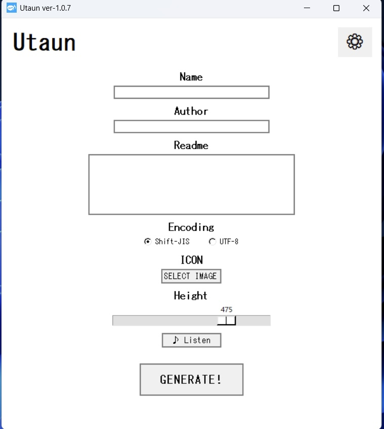
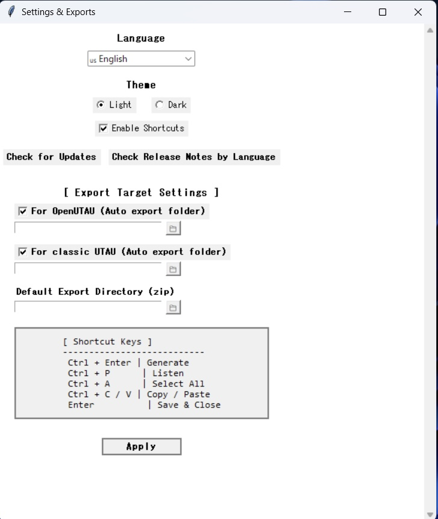
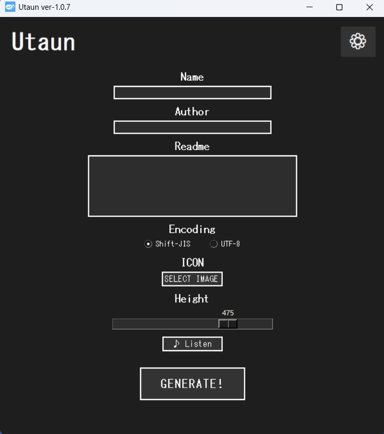
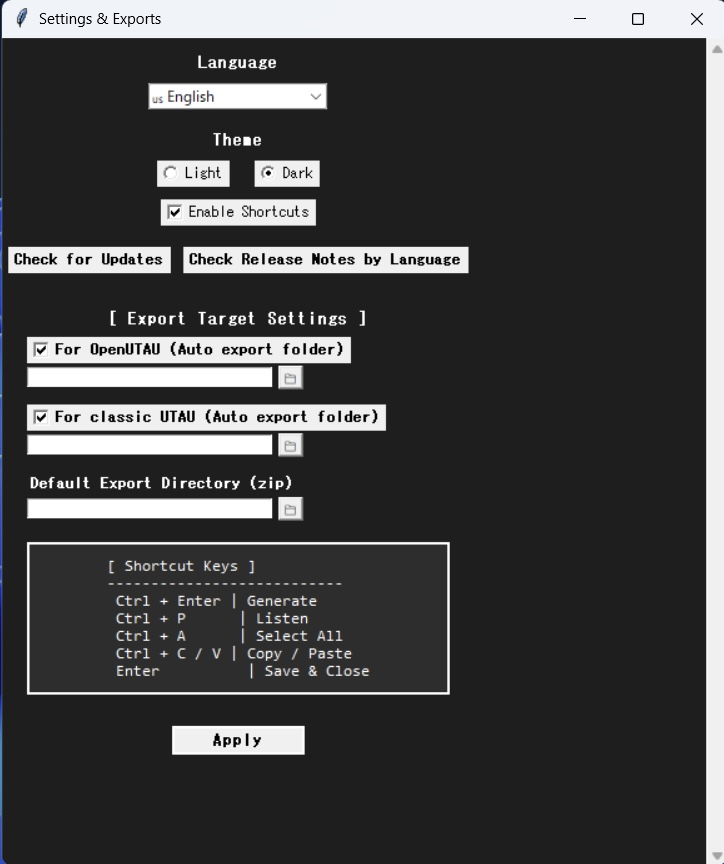
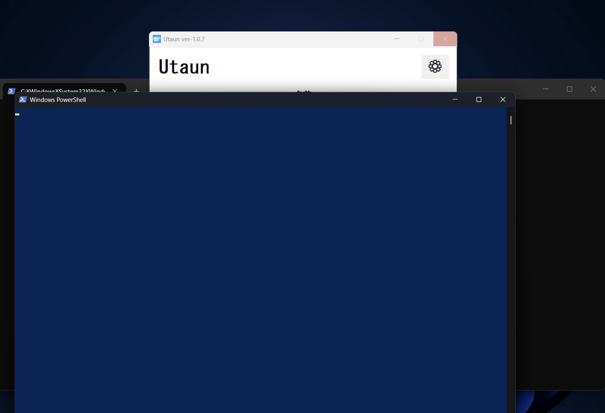
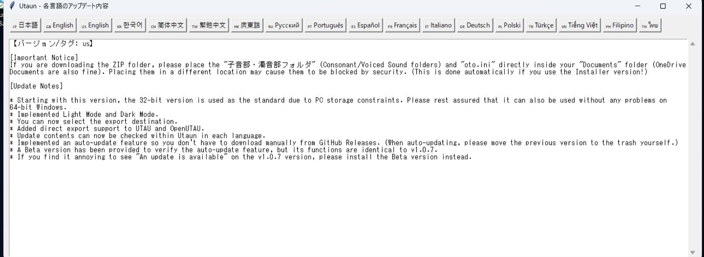
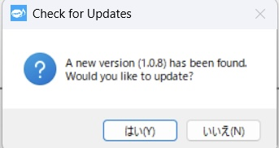

[🇵🇭 Bumalik sa pagpili ng wika](./README.md)
# Ano ang Utaun?  
  
Ang Utaun ay isang software para sa Windows na lumilikha ng mga CV (Katinig-Patinig) na voicebank para sa UTAU gamit ang eksklusibong walang-buhay na composite sinusoidal modeling (CSM speech synthesis).  
Sinusuportahan nito ang awtomatikong paggawa ng ZIP archive ng voicebank sa Documents folder, pati na rin ang direktang pag-export sa iba't ibang software na katugma ng UTAU.  

# Mga Tampok  

* Awtomatikong gumagawa ng voicebank ZIP file sa iyong Documents folder o direktang nag-e-export sa katugmang software kapag binuksan.  
* Lumilikha ng mga patinig (A, I, U, E, O, N) sa pamamagitan ng eksklusibong walang-buhay na composite sinusoidal modeling (CSM speech synthesis).  
* I-setup ang mga kasamang katinig at voiced sound folders sa iyong Documents directory upang lumikha ng mga CV voicebank.  
* Awtomatikong gumagawa ng mga row na m, n, y, at w sa loob ng programa.  
* Sinusuportahan ang mga Hiragana alias + English Romaji alias (lahat ng bigkas ay sa wikang Hapon).  
* Awtomatikong gumagawa ng `oto.ini`, `character.txt`, at `readme.txt`.  
* Sabay-sabay na nagko-convert ng mga PNG image sa JPG at BMP format (Paalala: Ang JPG ay ginagamit para sa `character.txt`).  
* Ang encoding ng `readme.txt` at `character.txt` ay maaaring piliin sa pagitan ng **Shift-JIS (ANSI)** at **UTF-8** (Paalala: Tinitiyak ng UTF-8 ang compatibility sa OpenUTAU at iba pa).  
* Nagbibigay-daan upang baguhin ang fundamental frequency (taas ng boses).  
* Malayang nako-customize na pangalan ng voicebank (pangalan ng karakter).  
* **Sinusuportahan ang Light at Dark modes.**  
* **Nagbibigay-daan sa pagpili ng destinasyon ng pag-export.**  

# Layunin ng Paggamit  

* Kapag nais mong lumikha ng mga UTAU voicebank gamit ang mga walang-buhay o artipisyal na boses.  
* Para sa produksyon ng voicebank kung nahihirapan o hindi ka komportable na mag-record gamit ang iyong sariling boses.  
* Pananaliksik sa mga audio material batay sa composite sinusoidal modeling (CSM speech synthesis).  
* Paggawa ng prototype para sa mga customized na voicebank.  
* Pag-extract sa nalikhang ZIP file upang direktang gamitin bilang mga mapagkukunan para sa hinalintulad na boses ng tao (human-simulated vocaloid assets).  
* Paggamit bilang audio material para sa mga video remix (hal. OtoMAD, YTPMV).  

# Paano Gamitin ang Utaun  

① I-download ang pinakabagong bersyon ng Utaun mula sa **[GitHub Releases](#Releases)**.  
② Kung dini-download mo ang ZIP folder na bersyon, **ilagay ang "Consonant/Voiced Sound" folders at `oto.ini` nang direkta sa loob ng iyong "Documents" folder (suportado rin ang OneDrive Documents).** (Paalala: Awtomatiko silang nailalagay kung gagamitin ang installer version).  
③ Ilagay ang `Utaun.exe` sa anumang folder na iyong napili.  
④ Simulan ang `Utaun.exe` at sundin ang mga tagubilin sa screen upang likhain ang iyong voicebank.  
⑤ Bilang lokasyon ng pag-save ng data, maaari kang pumili sa pagitan ng ZIP output (Documents, atbp.) o direktang pag-export ng folder sa UTAU at OpenUTAU.  
*Paalala: Ang tampok na awtomatikong pag-update ay magiging available sa mga susunod na bersyon.*  

# UI
**UI (Screen ng Operasyon - Light)**   
   
**UI (Screen ng Mga Setting - Light)**  

**UI (Screen ng Operasyon - Dark)**  
  
**UI (Screen ng Mga Setting - Dark)**  
  
**UI (Screen ng Pag-export)**  
  
**UI (Screen ng Detalye ng Update)**  
  
**UI (Screen ng Update)**  

# Compatibility at Paggamit ng mga Nilikhang Voicebank  

* **UTAU**  
  Direktang i-export bilang uncompressed voicebank folder sa iyong `voice` folder mula sa loob ng app at gamitin ito kaagad.  
* **OpenUTAU**  
  Direktang i-export bilang uncompressed voicebank folder sa iyong `Singers` folder mula sa loob ng app at gamitin ito kaagad.  
* **UtauTTS**  
  I-extract ang in-export na ZIP file at ilagay ito sa `voice` folder ng `utauTTS`.  
* **UtauV**  
  I-drag and drop ang ZIP file sa window ng tumatakbong UtaunV application.  
* **UTAlet (Web Version)**  
  I-drag and drop ang ZIP file sa screen ng opisyal na website.  
*Paalala: Para sa mga tiyak na tagubilin sa paggamit sa bawat software o web environment, mangyaring sumangguni sa kani-kanilang mga help file, manual, o opisyal na dokumentasyon.*  

# Mga Kinakailangan sa System  

* Windows 10 hanggang 11 (suportado ang 64-bit / 32-bit)  
**(Paalala: Ang 32-bit na bersyon ang ginagamit bilang base dahil sa laki ng file, ngunit maayos din itong tumatakbo sa 64-bit Windows.)**  

# Mga Hindi Sinusuportahang Tampok  

* Mga voiced vowel (あ゙, い゙, ゔ, え゙, お゙)  
* Mga expressive variation tulad ng bulong, paghinga, o mga bahagi ng buga ng hangin  
* Mga palatalized sound (hal.: kya, kyu, kyo / sha, shu, sho)  
* VCV (Continuous Vowels)  
* CVVC  
* Iba pang mga espesyal na pagbigkas  

# Mga Tuntunin ng Paggamit  

Ang mga sumusunod na aksyon ay mahigpit na ipinagbabawal para sa mismong Utaun application (`Utaun.exe`):  
* Pagbabago (Modification)  
* Pag-edit  
* Pag-alter  
* Komersyal na paggamit  
* Muling pamamahagi (Redistribution)  
* Pag-decompila (Disassembly)  

# Nilikhang Nilalaman  

(Mga voicebank, `.wav` file, `icon.jpg` / `icon.bmp`, `oto.ini`, atbp.)  
Malaya kang (ang distributor) magtakda ng sarili mong mga tuntunin ng paggamit para sa mga nilikhang nilalaman.  
Mangyaring isulat ang iyong gustong mga tuntunin ng lisensya sa loob ng `readme.txt`.  

Para sa impormasyon tungkol sa mga update at detalye, mangyaring suriin ang pahina ng **Releases** sa GitHub.  

# Releases  
[Download Filipino Version of Utaun →](https://github.com/SiveProjectOfficial/Utaun/releases/tag/🇵🇭)
