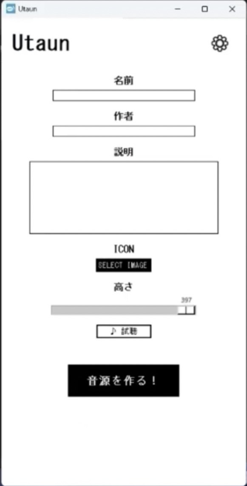

[🇷🇺 Вернуться к выбору языка](./README.md)

# 【Что такое Utaun?】
Программа для Windows, создающая голосовые банки CV для UTAU с помощью аддитивного синтеза. ZIP-архив создается в папке «Документы».

### 【Особенности】
* Автогенерация ZIP в «Документах».
* Создание гласных (a, i, u, e, o, n) через аддитивный синтез.
* Работа с внешними согласными (ряды Ka-Pa).
* Поддержка алиасов на хирагане и ромадзи.
* Автосоздание `oto.ini`, `character.txt` и `readme.txt`.

**UI image**
 

### 【Условия】
Запрещено изменять или перепродавать программу. Права на созданные голоса принадлежат вам.

Releases
https://github.com/SiveProjectOfficial/Utaun/releases/tag/🇷🇺

### Разрешение на распространение Utaun

[Разрешение на распространение Utaun](./РазрешениенараспространениеUtaun.md)

